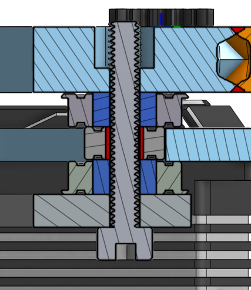
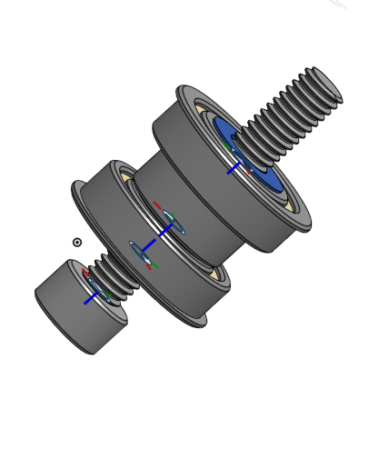

# Bearing Stack Turret with Vernier Encoder (BETA)

Designed by **Stefan** 
*Alum of FRC 5654 (Phoenix) | Mentor for FTC 12201 (TATOOINE)*

> **⚠️ STATUS: BETA & UNTESTED**
> I designed this setup for fun. It is currently in Beta and has not been fully tested yet. Feel free to copy, use, and learn from it, but please provide credit if you use or adapt this design!

*(TODO: Place a picture of the fully assembled physical turret here)*

## CAD & Files Availability
I will not publish the native CAD (at least not anytime soon). However, I do publish the **STLs, DXFs, and example code** here for you to use. Sometime in the future, I will publish the Onshape document.

### Repository Structure
* **`STL/`** - Contains all the 3D printable STL files (like the bearing adapters).
* **`DXF/`** - Contains the DXF files for machining/cutting the main plate and inner brace.
* **`code/`** - Contains the example code for reading the encoders and controlling the turret.
* **`PICS/`** - Reference images and CAD renders.

## Overview
This is a custom Bearing Stack Turret featuring a vernier encoder setup. 

**Top View:**

**Bottom View:**

### How the Vernier Encoder Works
A vernier encoder setup uses two absolute encoders driven by gears with slightly different tooth counts—in this design, the motorized encoder A uses a 25-tooth gear and encoder B uses a 20-tooth gear, both interacting with the 100-tooth main gear. Because of the difference in tooth counts, the two encoders rotate at different speeds relative to each other as the main turret turns. By measuring the mathematical difference (or phase shift) between the readings of these two encoders, the software can calculate the exact absolute position of the main turret. This allows you to get highly precise, absolute positioning over multiple rotations without needing to mount a massive, expensive hollow-bore absolute encoder directly to the center of the turret.

---

## Bill of Materials (BOM) & Visual Part List

Below is a complete list of required parts with their CAD references. *(TODO: Add physical pictures of manufactured parts as they are made).*

### Electronics & Motors
* **1 or 2x Axon MINI Servos:** Used for turret rotation. With an Axon MINI, the max turret RPM is ~27.
  * *(TODO: Physical Part Image - Axon MINI)*
* **1x Axon MAX or Axon MINI (for Encoder B):** 
  * 🛑 **CRITICAL WARNING:** This is used *strictly* for its encoder. **DO NOT plug in the PWM cable.** Only plug in the analog sensor.
  * *(TODO: Physical Part Image - Axon MAX/MINI)*

### Gears
* **1x Main Gear:** 100 Teeth
  * 
* **1 or 2x Encoder A Gear (Motorized):** 25 Teeth 
  * 
* **1x Encoder B Gear:** 20 Teeth
  * 
* **2 or 3x Servo Gears (15T Gear to 25T Spline):** 
  * *(TODO: CAD/Physical Image - Servo Gear)*
  * *Builder's Note:* My current printed version requires disassembling the servo and heat-pressing the adapter. This is bad and I don't recommend it. Instead, I highly recommend using COTS alternatives like **REV-41-1364-PK4** or **goBILDA 2305-0025-0015**.

### Bearing Stacks (Hardware)
You will need **6 bearing stacks** in total (4 will technically work, but 6 is highly recommended). 

**For EACH of the 6 stacks, you need:**
* **2x Big Bearings:** Standard round goBILDA bearings.
* **2x Printed Adapters:** 4mm screw to 8mm goBILDA ID.
* **1x Small Bearing:** 4x10x4mm
* **1x M4 Screw & Nut:** Nylock nuts highly recommended.

### Structural Plates & Materials
* **Main Plate:** 6061 Aluminum is highly recommended. (Polycarbonate might work, but advised against).
  * 
* **Inner Brace:** Polycarbonate works well.
  * 

---

## Assembly Guide

### Step-by-Step (Lego-Style) Instructions

**Step 1: Bearing Stack Pre-Assembly**
* Assemble the 6 bearing stacks using the big bearings, small bearing, printed adapters, and M4 hardware. Ensure Nylock nuts are secure but allow the bearings to spin freely.
* 
* *(TODO: Physical assembly step picture)*

**Step 2: Installing Stacks to the Inner Brace**
* Mount the assembled bearing stacks onto the inner brace. 
* *(Reference `inner brace cad top.png` and `bottom view asm.png` for layout)*
* *(TODO: Physical assembly step picture)*

**Step 3: Main Plate & Gear Alignment**
* Sandwich the main 100T gear and fit the main plate over the bearing stacks. Double-check that the turret rotates smoothly without binding.
* *(Reference `iso view asm.png` for stacking order)*
* *(TODO: Physical assembly step picture)*

**Step 4: Servo & Vernier Encoder Mounting**
* Mount the 1 or 2 Axon MINIs (with 25T Gear A) and the passive Axon MAX/MINI (with 20T Gear B). 
* Carefully align the gear mesh before fully tightening the mounting screws to prevent stripping the teeth under load.
* *(Reference `top view asm.png` for gear positions)*
* *(TODO: Physical assembly step picture)*

**Step 5: Final Wiring & Verification**
* Route the servo cables. Remember to ONLY plug in the analog sensor cable for the Encoder B servo.
* *(TODO: Physical wiring/verification step picture)*

## License & Usage
Made for the robotics community. You are welcome to copy, use, and learn from this design. Please credit Stefan / FRC 5654 / FTC 12201 when sharing or implementing.
